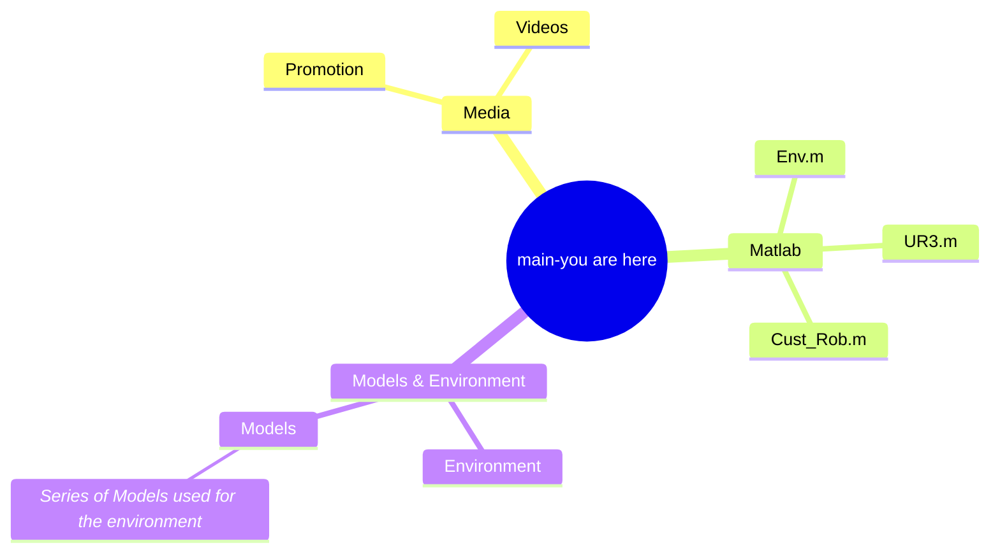

# Industrial Robotics A2 Git Repository 

This git Repository provides all the files used for the Assessment 2 task- pick and place dogoodbot. Here, you will find models, code files and miscellaneous items that are relative to the task.

### Project Brief
| Name  | ChefMate |
| ------------- | ------------- |
| Description  | A kitchenhand assistant cobot system designed for restaurants or domestic  |
| Robot Models  | UR3 & .....  |
| Environment  | A kitchen of a fast food restaurant  |

### Authors & Contributors
+ `🏋️ Rohit Bhat (TAHBTIHOR)   14160232`  [📧](rohit.p.bhat@student.uts.edu.aul)
+ ` 🏯 Michele Liang ( ) 13980230 ` [📧](michele.liang@student.uts.edu.au)
+ `🎱: Yves Gayagay (Codebetterordietrying) 14278055 ` [📧](yves.b.gayagay@student.uts.edu.au) 

### Safety Documentation
This project identifies the hazards that may occur in the work environment during operation and the appropriate actions of control through the following documentation.                                                               
[**Risk Assessment**](https://github.com/Codebetterordietrying/INDR_A2/blob/main/LA2-%20RIsk%20Assessment%20(Names%20Updated).pdf)  &  [**SWMS**](https://github.com/Codebetterordietrying/INDR_A2/blob/main/UTS%20SWMS%20A2%20(14278055).pdf)

### Contents
Here, you will find the layout of the branches and files inside this repository.

